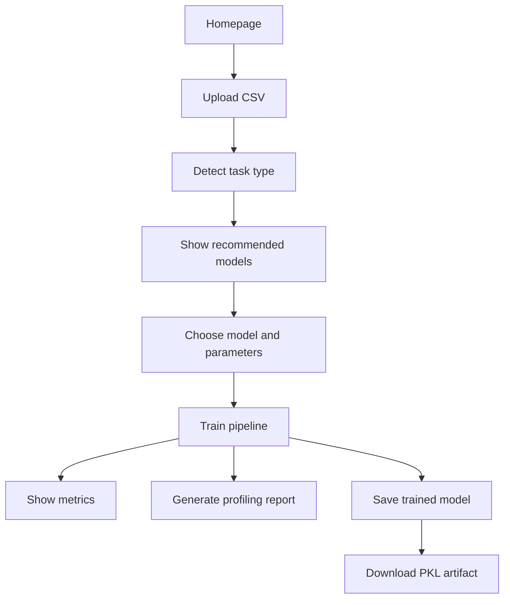
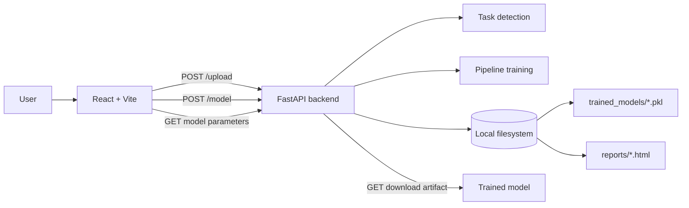

# 🚀 EasyTrain

> Transform CSV datasets into trained machine learning models, performance metrics, and visual reports in a guided, no-code workflow.

EasyTrain is a full-stack web app that helps users upload a dataset, detect the machine learning task, choose a recommended model, tune hyperparameters, train the model, and download the trained artifact plus an auto-generated profiling report.

---

## ✨ At a Glance

| Item | What it is |
| --- | --- |
| Frontend | React + Vite single-page app with animated landing, upload, and training views |
| Backend | FastAPI service for model selection, training, download, and report generation |
| ML Tasks | Binary classification, multi-class classification, and regression |
| Storage | Local filesystem for trained models and HTML reports |
| Authentication | None implemented |
| Database | None implemented |    

> [!NOTE]
> The app is intentionally simple for end users: upload a CSV, set the target column, review the suggested model, train, and export results.

---

## 🧠 Overview

EasyTrain exists to remove the friction from traditional machine learning setup.

Instead of writing a full notebook or building a manual training pipeline, a user can:

1. Upload a CSV file.
2. Enter the target column name.
3. Let the backend detect the task type.
4. Choose a recommended model.
5. Adjust the available hyperparameters.
6. Train the model.
7. Download the trained pipeline and inspect the profiling report.

This makes the project useful for:

- Non-technical users who want guided ML automation.
- Data analysts who need a fast prototype workflow.
- Developers and recruiters who want to review a clean end-to-end ML app.
- Clients who want a polished demo of automated training.

---

## ✨ Features

| Feature | What it does | User benefit |
| --- | --- | --- |
| CSV upload | Accepts a dataset and target column from the UI | Makes the workflow fast and beginner-friendly |
| Automatic task detection | Detects regression, binary classification, or multi-class classification based on the target column | Removes manual setup and guesswork |
| Recommended model list | Returns the model family and supported models for the detected task | Helps users start with a sensible baseline |
| Hyperparameter grid fetching | Loads the available tuning options for the selected model | Keeps tuning focused and structured |
| Preprocessing pipeline | Handles datetime columns, formatting, missing values, scaling, and encoding | Produces cleaner inputs for training |
| Model training | Fits the chosen pipeline on the uploaded data | Delivers a trained model with minimal effort |
| Metrics output | Shows regression or classification metrics after training | Gives immediate feedback on model quality |
| Model download | Provides a downloadable `.pkl` model artifact | Lets users reuse or deploy the trained model |
| Profiling report | Generates a `ydata-profiling` HTML report | Gives users a quick dataset overview and EDA-style summary |
| Polished UI | Uses a modern animated SaaS-style interface | Makes the product feel premium and easy to use |

---

## 🛠 How It Works

The full flow is intentionally straightforward:

1. The user opens the landing page and clicks into the app.
2. The user uploads a CSV file and enters the target column.
3. The backend reads the dataset and detects the task type.
4. The frontend shows the recommended model family and model options.
5. The user selects a model and adjusts the available hyperparameters.
6. The backend preprocesses the dataset, trains the pipeline, and computes metrics.
7. The backend stores the trained pipeline locally and creates a profiling report.
8. The frontend shows the results, the model download link, and the embedded report.



---

## 📸 Product Walkthrough

The screenshots in this project tell the story of the app well. Here is the intended user journey:

| Stage | What the user sees | What is happening |
| --- | --- | --- |
| 1. Landing page | A premium hero section with a clear CTA and animated workflow preview | The app introduces the ML flow and invites the user to start |
| 2. Upload screen | A centered upload card with CSV input and target column field | The dataset is sent to the backend for task detection |
| 3. Training dashboard | Recommended model, hyperparameter cards, and a premium Train button | The user configures the run before launching training |
| 4. Results section | Metrics cards, download link, and embedded profiling report | The trained artifact and report are ready for review |

### Suggested storytelling flow

Homepage
↓
Upload CSV
↓
Detect task
↓
Select model
↓
Tune hyperparameters
↓
Train model
↓
Review metrics
↓
Download artifact
↓
Open profiling report

> [!TIP]
> If you add screenshots to the repository later, place them near these walkthrough sections so the README feels like a guided product demo.

---

## 🔄 User Journey


---

## 🏗 Architecture

EasyTrain uses a simple client-server architecture:

- The React frontend handles the user experience and navigation.
- The FastAPI backend performs task detection, model training, and artifact generation.
- Trained models and profiling reports are stored on the local filesystem.
- Reports are served as static HTML files.



### Frontend

- Landing page with animated SaaS-style visuals.
- CSV upload page.
- Training dashboard with model selection, hyperparameters, loading states, and results.

### Backend

- FastAPI app with CORS enabled.
- Routes for uploading data, fetching parameters, training models, and downloading the trained pipeline.
- Uses pandas, scikit-learn, xgboost, joblib, and ydata-profiling.

### Storage

- `backend/trained_models/` stores pickled pipelines.
- `backend/reports/` stores generated HTML profiling reports.

### Authentication

- No login, role, or permission system is implemented in the current codebase.

### Database

- No database is implemented.
- The app relies on uploaded files and local filesystem artifacts.

---

## 🔌 API Routes

| Method | Route | Purpose | Response |
| --- | --- | --- | --- |
| `POST` | `/upload` | Reads the CSV and detects the task type | Returns the recommended model family and available models |
| `POST` | `/model` | Trains the selected model with the chosen parameters | Returns the download path, summary metrics, and report URL |
| `GET` | `/download/{key}` | Downloads the trained model artifact | Returns the `.pkl` file |
| `GET` | `/model/parameters/{model_name}/{model_type}` | Fetches the hyperparameter grid for a selected model | Returns parameter options for the UI |

### Response shape from `/model`

The backend returns a JSON object shaped like this:

- `model_key`: download path for the trained model.
- `other_info`: metrics and summary values.
- `report_url`: path to the generated profiling report.

---

## 📂 Project Structure

```text
EasyTrain/
├── backend/
│   ├── main.py
│   ├── model/
│   │   ├── model_select.py
│   │   └── preprocessing.py
│   ├── Select_model/
│   │   └── select_model.py
│   ├── trained_models/
│   └── reports/
├── frontend/
│   ├── src/
│   │   ├── App.jsx
│   │   ├── pages/
│   │   │   ├── land_page/
│   │   │   ├── model_select.jsx
│   │   │   └── train_model.jsx
│   │   ├── assets/
│   │   └── index.css
│   ├── package.json
│   └── vite.config.js
└── README.md
```

### Important files

- `backend/main.py` contains the FastAPI routes.
- `backend/model/model_select.py` decides which model family fits the dataset.
- `backend/model/preprocessing.py` builds the preprocessing and training pipeline.
- `backend/Select_model/select_model.py` defines the model registry and hyperparameter grids.
- `frontend/src/pages/land_page/land_page.jsx` renders the animated marketing homepage.
- `frontend/src/pages/model_select.jsx` handles dataset upload and target input.
- `frontend/src/pages/train_model.jsx` renders model selection, tuning, training, and results.

---

## ⚙ Tech Stack

| Category | Technology | Purpose |
| --- | --- | --- |
| Frontend framework | React 19 | Component-based UI |
| Build tool | Vite | Fast local development and production builds |
| Routing | React Router | Page navigation inside the SPA |
| HTTP client | Axios | API requests from the frontend |
| Animation | Framer Motion | Smooth landing page motion and micro-interactions |
| Backend framework | FastAPI | API layer and file-based processing |
| ASGI server | Uvicorn | Runs the backend locally |
| Data processing | Pandas | CSV loading and dataset handling |
| ML pipeline | scikit-learn | Preprocessing, pipelines, metrics, model training |
| Gradient boosting | XGBoost | Additional model options |
| Report generation | ydata-profiling | Interactive profiling report HTML |
| Serialization | Joblib | Saving trained pipelines |
| Static file serving | FastAPI StaticFiles | Serving generated reports |
| Cross-origin support | CORS middleware | Development-friendly API access |

---

## 📊 Core Functionality Deep Dive

| Module | Purpose | Inputs | Outputs | User value |
| --- | --- | --- | --- | --- |
| Landing page | Introduces the app and explains the workflow | User browser | Branded homepage | Builds trust and sets context |
| Upload page | Collects the CSV and target column | CSV file, target name | `/upload` request | Starts the ML workflow quickly |
| Task detection | Determines the model family | Dataset + target column | `logistic_model`, `softmax_model`, or `regression_model` | Removes setup guesswork |
| Model registry | Lists the models available for the task | Detected task type | Model options and grids | Gives users a practical shortlist |
| Parameter loader | Fetches tunable values for the selected model | Model name + task type | Hyperparameter options | Makes tuning easy and structured |
| Training pipeline | Handles preprocessing and model fitting | Dataset, target, model, parameter values | Trained pipeline and metrics | Produces a ready-to-use result |
| Results view | Shows metrics, download link, and report | Backend response | Visual summary and iframe | Makes the outcome easy to review |

### What the backend preprocessing does

The preprocessing pipeline currently handles:

- Datetime parsing and feature expansion.
- Text cleanup and formatting for categorical columns.
- Missing value imputation.
- Numerical scaling.
- Ordinal encoding for high-cardinality categorical columns.
- One-hot encoding for lower-cardinality categorical columns.
- Pipeline assembly with scikit-learn `Pipeline` and `ColumnTransformer`.

### Metrics returned by the backend

- Regression: MAE, MSE, RMSE, R², and CV mean score.
- Classification: Accuracy, Precision, Recall, F1 score, and CV mean score.

---

## 🎯 Real User Benefits

EasyTrain helps users:

- Go from CSV to trained model without writing a training notebook.
- Reduce time spent on repetitive preprocessing setup.
- Compare model quality using clear metrics.
- Export a trained pipeline for later use.
- Review a profiling report without leaving the app.
- Present a polished demo to teammates, clients, or recruiters.

---

## 💡 Unique Selling Points

- Guided ML workflow instead of a blank notebook.
- Automatic task detection from the target column.
- Built-in preprocessing and model training pipeline.
- Separate model download and profiling report generation.
- A premium-looking frontend that feels like a modern AI SaaS product.
- Simple enough for beginners, but still useful as a prototype for experienced builders.

---

## 🔐 Security & Authentication

### Current state

- No authentication system is implemented.
- No user accounts, login screens, or role-based permissions exist.
- The backend uses open CORS settings for development convenience.

### Data handling

- Uploaded files are processed directly by the backend.
- Trained models are saved locally as `.pkl` files.
- Profiling reports are saved locally as HTML files and served statically.

> [!IMPORTANT]
> Because CORS is currently open and there is no authentication, the app is best suited to demos, internal tools, and controlled deployments unless you add extra protection later.

---

## 🚀 Installation

### Prerequisites

- Python 3.10+ recommended.
- Node.js 18+ recommended.
- npm installed.

### 1) Clone the repository

```bash
git clone https://github.com/keshav123333/EasyTrain.git
cd EasyTrain
```

### 2) Start the backend

```bash
cd backend
python -m venv .venv
source .venv/bin/activate
pip install fastapi uvicorn pandas scikit-learn xgboost ydata-profiling joblib python-multipart
uvicorn main:app --reload
```

The backend runs on the default Uvicorn host and port, usually `http://127.0.0.1:8000`.

### 3) Start the frontend

```bash
cd ../frontend
npm install
npm run dev
```

The frontend runs through Vite, usually at `http://localhost:5173`.

### 4) Build for production

```bash
cd frontend
npm run build
```

### Important local-development note

> [!TIP]
> The React pages currently point to the hosted backend URL that is hardcoded in the source. If you want fully local development, update the backend base URL constants in the upload and training pages so they point to your local FastAPI server.

### Production deployment notes

- Serve the FastAPI backend with a production ASGI server.
- Make sure the `trained_models/` and `reports/` folders are writable.
- Build the frontend with Vite and serve the `dist/` folder.
- If you deploy the backend to a new domain, update the frontend API base URL.

---

## 📌 Database & Storage

| Area | Status | Notes |
| --- | --- | --- |
| Database | Not used | There is no SQL or NoSQL database layer in the current implementation |
| File storage | Used | Trained `.pkl` files and HTML reports are stored locally |
| Persistence | Local filesystem | Artifacts remain available as long as the server storage is preserved |

---

## 🧩 Future Improvements

These are realistic next steps based on the current architecture:

- Add environment variables for API base URLs.
- Add authentication and user accounts.
- Add background job processing for long training runs.
- Add model history and artifact versioning.
- Persist metadata in a database.
- Add download history and report archive pages.
- Add progress updates while training is running.
- Add test coverage for API routes and preprocessing.
- Add Docker support for repeatable deployment.

---

## 🤝 Contributing

Contributions are welcome.

1. Fork the repository.
2. Create a feature branch.
3. Make focused changes.
4. Test your changes locally.
5. Open a pull request with a clear summary.

### Good contribution targets

- UI polish.
- Accessibility improvements.
- Better error handling.
- Additional model families.
- Stronger deployment configuration.

---

## 📄 License

This project is released under the MIT License — see the `LICENSE` file for details.

To view the full license text, open [LICENSE](LICENSE) in the repository root.

SPDX: `MIT`

---

## ⭐ Closing Note

EasyTrain combines a clean frontend, a practical FastAPI backend, and an automated ML workflow into a single polished product. It is small enough to understand quickly, but complete enough to demonstrate a real end-to-end machine learning experience.
